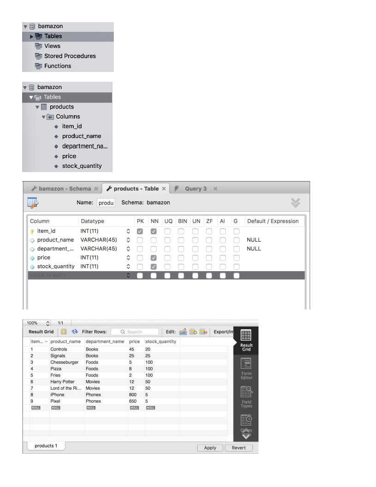
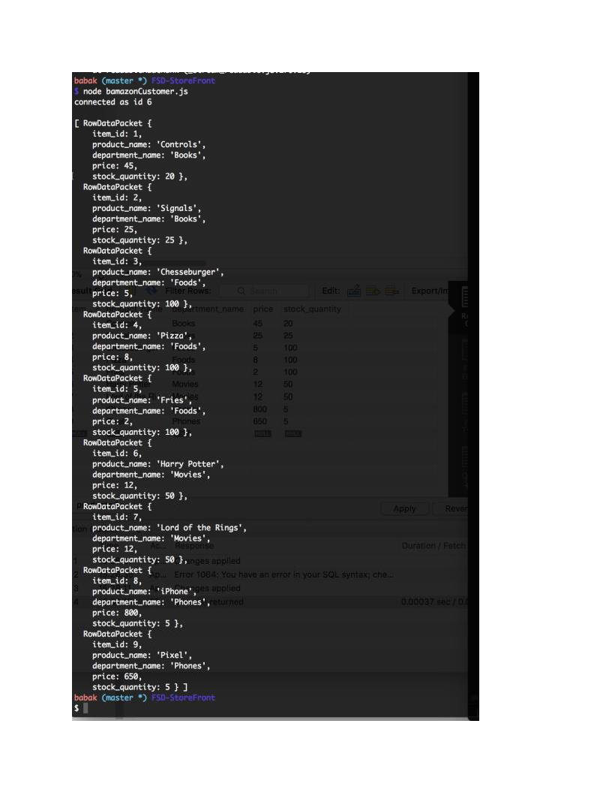

# FSD-StoreFront
Full Stack Developer Project: Built an Amazon-like Storefront application using Node.js and MySQL.

## Table Creation Using MySQL

1. Created a MySQL Database called `bamazon`.

2. Created a Table inside of the database called `products`.

3. The products table includes the following columns:

   * item_id (unique id)

   * product_name 

   * department_name

   * price

   * stock_quantity

4. Populated this database with different products.

### Screenshots

## App Creation Using Node.js

5. Created a Node application called `bamazonCustomer.js`. Ran the application to display all of the items available for sale. 

6. The app prompts users with two messages.

   * First asks them the ID of the product they would like to buy.
   * Second asks how many units of the product they would like to buy.

7. Once the customer has placed the order, the application checks if the store has enough of the product to meet the customer's request.

   * If not, the app logs `Insufficient quantity!`, and then prevent the order from going through.

8. If the store have enough of the product, fulfills the customer's order.
   * Updates the SQL database to reflect the remaining quantity.
   * Shows the customer the total cost of their purchase.

### Screenshots

